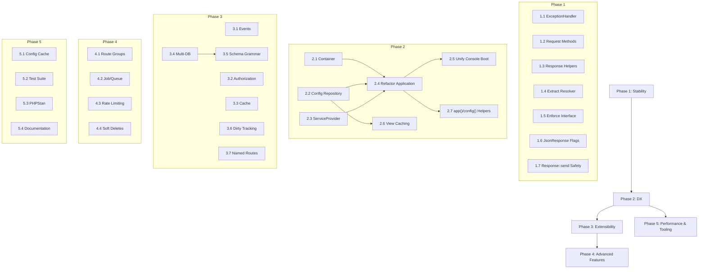

# Green Core — Architecture Improvement Plan

> **Companion to**: `docs/architecture-review.md`  
> **Date**: 2026-06-13  
> **Target Version**: v2.0.0 (Phases 1-3), v2.1+ (Phases 4-5)  

---

## Overview

This document provides a **practical, ordered task list** for implementing the architectural improvements identified in the review. Tasks are grouped by phase and ordered by dependency — later tasks build on earlier ones.

Each task includes:
- **Goal** — What we're trying to achieve
- **Files Expected to Change** — Specific files to create or modify
- **Risk Level** — Low / Medium / High
- **Testing Notes** — How to verify the change
- **Backward Compatible** — Yes / Soft Break / Breaking

---

## Phase 1: Stability & Consistency

> **Goal**: Fix critical reliability gaps without changing the public API surface.  
> **Estimated Duration**: 1–2 weeks  
> **Dependencies**: None — can start immediately  

---

### Task 1.1: Wire ExceptionHandler into Application::handle()

**Goal:**  
Ensure all exceptions thrown during HTTP request handling are caught and rendered as proper HTTP responses (JSON or HTML), instead of propagating to PHP's global error handler.

**Files Expected to Change:**
| Action | File |
|--------|------|
| Modify | `src/Application.php` |

**Implementation Details:**
1. Instantiate `ExceptionHandler` in `Application::__construct()`, injecting the existing `LogManager`
2. Wrap `$this->router->dispatch($request)` in a try/catch inside `handle()`
3. Catch `\Throwable` and delegate to `$this->exceptionHandler->handle($e, $request)`
4. Store the request reference so `ExceptionHandler` has access to it

```php
// Application.php
private ExceptionHandler $exceptionHandler;

public function __construct()
{
    $this->bootErrorHandling();
    $this->exceptionHandler = new ExceptionHandler($this->logManager);
    // ... rest of boot
}

public function handle(Request $request): Response
{
    try {
        return $this->router->dispatch($request);
    } catch (\Throwable $e) {
        return $this->exceptionHandler->handle($e, $request);
    }
}
```

**Risk Level:** Low  
**Testing Notes:**
- Create a controller that throws a `\RuntimeException` — verify JSON error response for API routes
- Create a controller that throws `ValidationException` — verify 422 status with errors array
- Set `APP_DEBUG=false` — verify no stack trace in response
- Set `APP_DEBUG=true` — verify stack trace is present
- Test that `GreenErrorKernel` still logs the error (via LogManager dedup)

**Backward Compatible:** ✅ Yes — Previously, exceptions would crash. Now they render properly. No existing behavior removed.

---

### Task 1.2: Enrich Request with Common Utility Methods

**Goal:**  
Add frequently needed methods to the Request class so application developers don't have to implement them manually.

**Files Expected to Change:**
| Action | File |
|--------|------|
| Modify | `src/Http/Request.php` |

**Methods to Add:**
```php
public function all(): array                           // Merged query + post + json body
public function only(array $keys): array               // Subset of input
public function except(array $keys): array             // All input except specified keys
public function has(string $key): bool                 // Check if input key exists
public function bearerToken(): ?string                 // Extract from Authorization header
public function isJson(): bool                         // Content-Type is application/json
public function wantsJson(): bool                      // Accept header prefers JSON
public function ip(): string                           // Client IP with proxy support
public function fullUrl(): string                      // URL with query string
public function isMethod(string $method): bool         // Check HTTP method
public function json(?string $key = null): mixed       // Parse JSON body
```

**Implementation Details:**
- `json()` should parse `php://input` and cache the result
- `bearerToken()` should extract from `Authorization: Bearer <token>` header
- `ip()` should respect `X-Forwarded-For` and `X-Real-IP` headers
- `all()` should merge query, post, and JSON body (if applicable)

**Risk Level:** Low  
**Testing Notes:**
- Unit test each method with mock `$_SERVER` / `$_POST` / `$_GET` data
- Test `bearerToken()` with various Authorization header formats
- Test `json()` body parsing with valid and invalid JSON
- Test `wantsJson()` with various Accept header values

**Backward Compatible:** ✅ Yes — Purely additive, no existing methods changed.

---

### Task 1.3: Enrich Response with Test Helpers

**Goal:**  
Add header retrieval and inspection methods to `Response` for testability.

**Files Expected to Change:**
| Action | File |
|--------|------|
| Modify | `src/Http/Response.php` |

**Methods to Add:**
```php
public function getHeaders(): array
public function getHeader(string $name): ?string
public function hasHeader(string $name): bool
public function withHeader(string $name, string $value): static  // Immutable variant
```

**Risk Level:** Low  
**Testing Notes:**
- Unit test each method
- Verify `JsonResponse` inherits these correctly

**Backward Compatible:** ✅ Yes

---

### Task 1.4: Extract Shared Resolver Logic

**Goal:**  
Eliminate code duplication between `ControllerResolver` and `MiddlewareResolver`.

**Files Expected to Change:**
| Action | File |
|--------|------|
| Create | `src/Routing/AbstractResolver.php` |
| Modify | `src/Routing/ControllerResolver.php` |
| Modify | `src/Routing/MiddlewareResolver.php` |

**Implementation Details:**
Extract the shared `build()`, `resolveParameter()`, and circular-dependency detection into an `AbstractResolver`:

```php
abstract class AbstractResolver
{
    private array $bindings = [];
    private array $resolving = [];

    public function bind(string $class, object|callable $instance): void { ... }

    protected function resolveFromBindings(string $class): object { ... }
    protected function build(string $class): object { ... }
    private function resolveParameter(string $class, \ReflectionParameter $param): mixed { ... }
}
```

`ControllerResolver` and `MiddlewareResolver` extend this, adding only their unique logic:
- `ControllerResolver::resolve()` — type check against controller class
- `MiddlewareResolver::resolve()` — supports object input + `guardHandleMethod()`

**Risk Level:** Low  
**Testing Notes:**
- Existing `RouterResolverTest.php` should pass without modification
- Add test for circular dependency detection
- Add test for auto-wiring constructor dependencies

**Backward Compatible:** ✅ Yes — Public API of both resolvers unchanged.

---

### Task 1.5: Enforce MiddlewareInterface in Resolver

**Goal:**  
Replace duck-type checking (`method_exists('handle')`) with proper interface enforcement.

**Files Expected to Change:**
| Action | File |
|--------|------|
| Modify | `src/Routing/MiddlewareResolver.php` |

**Implementation Details:**
```php
private function guardHandleMethod(object $middleware): object
{
    if (!$middleware instanceof MiddlewareInterface) {
        // Phase 1: Deprecation warning
        if (!method_exists($middleware, 'handle')) {
            throw new \RuntimeException(
                'Middleware [' . $middleware::class . '] must implement MiddlewareInterface.'
            );
        }
        // Log deprecation
        trigger_error(
            'Middleware [' . $middleware::class . '] should implement MiddlewareInterface. '
            . 'Duck-typing is deprecated and will be removed in v3.0.',
            E_USER_DEPRECATED
        );
    }
    return $middleware;
}
```

**Risk Level:** Low  
**Testing Notes:**
- Test with a class implementing `MiddlewareInterface` — should pass
- Test with a class that has `handle()` but no interface — should trigger deprecation
- Test with a class missing `handle()` — should throw RuntimeException

**Backward Compatible:** 🟡 Soft Break — Existing middleware without the interface gets a deprecation warning but continues to work.

---

### Task 1.6: Fix JsonResponse Missing json_encode Flags

**Goal:**  
Prevent JSON encoding errors from producing silent failures or malformed output.

**Files Expected to Change:**
| Action | File |
|--------|------|
| Modify | `src/Http/JsonResponse.php` |

**Implementation Details:**
```php
public function setData(mixed $data): static
{
    $json = json_encode($data, JSON_UNESCAPED_UNICODE | JSON_UNESCAPED_SLASHES | JSON_THROW_ON_ERROR);
    $this->content = $json;
    return $this;
}
```

**Risk Level:** Low  
**Testing Notes:**
- Test with Unicode data — verify no escaped unicode sequences
- Test with non-encodable data (e.g., resources) — verify `JsonException` thrown
- Test with nested objects implementing `JsonSerializable`

**Backward Compatible:** ✅ Yes — Output format slightly improved (unescaped unicode), but valid JSON parsers handle both.

---

### Task 1.7: Add Response::send() to Handle Headers-Already-Sent

**Goal:**  
Make `Response::send()` resilient to headers already being sent (e.g., during debugging).

**Files Expected to Change:**
| Action | File |
|--------|------|
| Modify | `src/Http/Response.php` |

**Implementation Details:**
```php
public function send(): void
{
    if (!headers_sent()) {
        http_response_code($this->statusCode);
        foreach ($this->headers as $name => $value) {
            header("{$name}: {$value}");
        }
    }
    echo $this->content;
}
```

**Risk Level:** Low  
**Testing Notes:**
- Verify normal responses still work
- Verify no errors when headers already sent

**Backward Compatible:** ✅ Yes

---

## Phase 2: Developer Experience

> **Goal**: Introduce foundational architecture (Container, Config, ServiceProviders) that enables all future improvements.  
> **Estimated Duration**: 2–3 weeks  
> **Dependencies**: Phase 1 should be complete (especially Task 1.4)  

---

### Task 2.1: Create Lightweight Service Container

**Goal:**  
Introduce an IoC container that supports binding, singleton resolution, auto-wiring, and interface-to-concrete mapping.

**Files Expected to Change:**
| Action | File |
|--------|------|
| Create | `src/Container/Container.php` |
| Create | `src/Container/NotFoundException.php` |
| Create | `src/Container/BindingException.php` |

**Implementation Details:**

The Container should support:
```php
// Binding
$container->bind(LoggerInterface::class, FileLogger::class);
$container->singleton(Database::class, fn() => new Database($config));
$container->instance(Request::class, $request);

// Resolution
$logger = $container->make(LoggerInterface::class);

// Auto-wiring
$controller = $container->make(UserController::class);
// → Reads constructor, resolves typed params from container

// Checking
$container->has(LoggerInterface::class); // true
```

Key design decisions:
- **No PSR-11 dependency** — but follow the interface shape for future compatibility
- **Auto-wiring enabled by default** — resolve class-typed constructor params automatically
- **Circular dependency detection** — reuse logic from the existing resolvers (Task 1.4)
- **Singleton cache** — `singleton()` bindings resolved once and cached

Target size: ~150-200 lines.

**Risk Level:** Medium  
**Testing Notes:**
- Test `bind()` + `make()` returns new instance each time
- Test `singleton()` + `make()` returns same instance
- Test `instance()` returns exact object
- Test auto-wiring with nested dependencies
- Test circular dependency throws `BindingException`
- Test unresolvable scalar params throw `BindingException`
- Test interface-to-concrete resolution

**Backward Compatible:** ✅ Yes — Purely additive. Nothing uses it yet.

---

### Task 2.2: Create Config Repository

**Goal:**  
Centralize all configuration into a single repository with dot-notation access, replacing scattered `$_ENV` reads and individual config file loading.

**Files Expected to Change:**
| Action | File |
|--------|------|
| Create | `src/Config/Repository.php` |

**Implementation Details:**
```php
class Repository
{
    private array $items = [];

    public function __construct(array $items = []) { $this->items = $items; }

    // Dot-notation: $config->get('database.host', '127.0.0.1')
    public function get(string $key, mixed $default = null): mixed { ... }
    public function set(string $key, mixed $value): void { ... }
    public function has(string $key): bool { ... }
    public function all(): array { ... }

    /**
     * Load all PHP files from a directory.
     * File 'database.php' returning ['host' => 'localhost']
     * becomes accessible as config('database.host')
     */
    public function loadDirectory(string $path): void { ... }
}
```

**Risk Level:** Medium  
**Testing Notes:**
- Test dot-notation get/set/has
- Test `loadDirectory()` with multiple config files
- Test nested array access
- Test default values for missing keys
- Test overwriting existing keys

**Backward Compatible:** ✅ Yes — Purely additive.

---

### Task 2.3: Create ServiceProvider Base Class

**Goal:**  
Provide a standard mechanism for registering and booting framework subsystems.

**Files Expected to Change:**
| Action | File |
|--------|------|
| Create | `src/Support/ServiceProvider.php` |

**Implementation Details:**
```php
abstract class ServiceProvider
{
    public function __construct(protected Application $app) {}

    /**
     * Register bindings into the container.
     * Called before any provider's boot() method.
     */
    public function register(): void {}

    /**
     * Bootstrap services after all providers are registered.
     * Safe to resolve dependencies here.
     */
    public function boot(): void {}
}
```

**Risk Level:** Low  
**Testing Notes:**
- Test that `register()` is called before `boot()`
- Test that providers receive the Application instance
- Test provider ordering

**Backward Compatible:** ✅ Yes

---

### Task 2.4: Refactor Application to Use Container and Providers

**Goal:**  
Integrate the Container and ServiceProvider system into `Application`, replacing `$GLOBALS`-based wiring while maintaining backward compatibility through helper functions.

**Files Expected to Change:**
| Action | File |
|--------|------|
| Modify | `src/Application.php` |
| Modify | `src/helpers.php` |
| Create | `src/Providers/LogServiceProvider.php` |
| Create | `src/Providers/DriveServiceProvider.php` |
| Create | `src/Providers/ConnectServiceProvider.php` |
| Create | `src/Providers/RoutingServiceProvider.php` |
| Create | `src/Providers/ViewServiceProvider.php` |

**Implementation Details:**

Application becomes the Container (or owns one):
```php
class Application
{
    private Container $container;
    private array $providers = [];

    public function __construct()
    {
        $this->container = new Container();
        $this->container->instance(Application::class, $this);

        $this->loadConfiguration();
        $this->registerProviders();
        $this->bootProviders();
    }

    public function make(string $abstract): mixed
    {
        return $this->container->make($abstract);
    }
}
```

Move existing `boot*()` logic into ServiceProviders:
```php
class LogServiceProvider extends ServiceProvider
{
    public function register(): void
    {
        $this->app->singleton(LogManager::class, function () {
            $manager = new LogManager();
            $manager->addDriver(new FileLogger($this->resolveLogDir()));
            return $manager;
        });
    }

    public function boot(): void
    {
        green_log_set_manager($this->app->make(LogManager::class));
    }
}
```

Update helpers to resolve from the container:
```php
function app(): Application {
    return $GLOBALS['__green_app'];
}

function drive(): Drive {
    return app()->make(Drive::class);
}

function connect(): Connect {
    return app()->make(Connect::class);
}
```

**Preserve backward compatibility** by keeping the `*_set_instance()` functions working (they delegate to container):
```php
function drive_set_instance(Drive $drive): void {
    // Deprecated but still works
    app()->instance(Drive::class, $drive);
}
```

**Risk Level:** Medium  
**Testing Notes:**
- All existing helper functions (`drive()`, `connect()`, `green_log()`, etc.) must continue to work
- Test that providers are registered before they are booted
- Test that `Application::make()` resolves registered services
- Test that controllers can receive services via constructor injection
- Regression test: boot the application and verify all subsystems work

**Backward Compatible:** ✅ Yes — Helpers maintain the same signatures. `$GLOBALS`-based setters still work but are deprecated.

---

### Task 2.5: Unify Console and HTTP Boot

**Goal:**  
Ensure CLI commands have access to the same services (logging, Drive, Connect, config) as HTTP requests.

**Files Expected to Change:**
| Action | File |
|--------|------|
| Modify | `src/Console/Kernel.php` |
| Modify | `src/Console/Commands/BaseCommand.php` |

**Implementation Details:**
```php
class Kernel
{
    protected Application $app;

    public function handle(): void
    {
        // Boot the main application (loads config, registers providers)
        $this->app = new \YasserElgammal\Green\Application();

        $consoleApp = new Console\Application();

        foreach ($this->coreCommands as $command) {
            $consoleApp->addCommand($this->app->make($command));
        }

        foreach ($this->commands as $command) {
            $consoleApp->addCommand($this->app->make($command));
        }

        $consoleApp->run();
    }
}
```

Update `BaseCommand` to receive dependencies via constructor or via `$this->app`:
```php
abstract class BaseCommand extends Command
{
    protected function getMigrationRunner(): MigrationRunner
    {
        // Now resolved from the container instead of manual wiring
        return app()->make(MigrationRunner::class);
    }
}
```

**Risk Level:** Medium  
**Testing Notes:**
- Run `green migrate:status` — verify it works without manual PDO setup
- Run `green serve` — verify it still works
- Verify `green_log()` works inside CLI commands
- Verify `drive()` works inside CLI commands

**Backward Compatible:** ✅ Yes — Commands continue to work, now with more services available.

---

### Task 2.6: Enable View Template Caching

**Goal:**  
Allow Twig to cache compiled templates in production, significantly reducing template parsing overhead.

**Files Expected to Change:**
| Action | File |
|--------|------|
| Modify | `src/View/View.php` |

**Implementation Details:**
```php
public static function init(string $viewsPath, ?string $cachePath = null, bool $debug = false): void
{
    $loader = new FilesystemLoader($viewsPath);
    self::$twig = new Environment($loader, [
        'cache' => $cachePath ?: false,
        'debug' => $debug,
        'auto_reload' => $debug, // Recompile when templates change in debug mode
    ]);
    // ... existing function registrations
}
```

The `ViewServiceProvider` would call:
```php
View::init(
    $config->get('view.path', BASE_PATH . '/views'),
    $config->get('view.cache', BASE_PATH . '/storage/cache/views'),
    $config->get('app.debug', false)
);
```

**Risk Level:** Low  
**Testing Notes:**
- Test with cache enabled — verify templates compile on first access
- Test with `auto_reload` — verify changes are picked up
- Test with cache disabled — verify no cache directory created
- Add `view:clear` command to delete cached templates

**Backward Compatible:** ✅ Yes — Cache is opt-in via config.

---

### Task 2.7: Add `config()` and `app()` Helper Functions

**Goal:**  
Provide convenient global access to the container and config repository.

**Files Expected to Change:**
| Action | File |
|--------|------|
| Modify | `src/helpers.php` |

**Implementation Details:**
```php
function app(?string $abstract = null): mixed
{
    $app = $GLOBALS['__green_app'] ?? null;
    if (!$app instanceof Application) {
        throw new \RuntimeException('Application has not been initialized.');
    }
    if ($abstract === null) {
        return $app;
    }
    return $app->make($abstract);
}

function config(string $key = null, mixed $default = null): mixed
{
    $config = app()->make(Config\Repository::class);
    if ($key === null) {
        return $config;
    }
    return $config->get($key, $default);
}
```

**Risk Level:** Low  
**Testing Notes:**
- Test `app()` returns Application instance
- Test `app(SomeClass::class)` resolves from container
- Test `config('database.host')` returns config value
- Test `config('missing.key', 'default')` returns default

**Backward Compatible:** ✅ Yes

---

## Phase 3: Extensibility

> **Goal**: Add the missing architectural pieces that enable complex applications and third-party packages.  
> **Estimated Duration**: 2–4 weeks  
> **Dependencies**: Phase 2 must be complete (Container + Config + Providers)  

---

### Task 3.1: Add Event Dispatcher

**Status:** Completed

**Goal:**  
Enable decoupled communication between framework components and application code through an event system.

**Files Expected to Change:**
| Action | File |
|--------|------|
| Create | `src/Events/EventDispatcher.php` |
| Create | `src/Events/Event.php` |
| Create | `src/Providers/EventServiceProvider.php` |

**Implementation Details:**
```php
class EventDispatcher
{
    /** @var array<string, list<callable>> */
    private array $listeners = [];

    public function listen(string $event, callable|string $listener): void
    {
        $this->listeners[$event][] = $listener;
    }

    public function dispatch(object $event): object
    {
        $eventClass = get_class($event);
        foreach ($this->listeners[$eventClass] ?? [] as $listener) {
            if (is_string($listener)) {
                $listener = app()->make($listener);
            }
            $listener($event);
        }
        return $event;
    }

    public function hasListeners(string $event): bool { ... }
    public function forget(string $event): void { ... }
}
```

Framework lifecycle events to add:
- `RequestReceived` — dispatched at the start of `handle()`
- `RequestHandled` — dispatched after response is created
- `ExceptionOccurred` — dispatched when exception is caught
- `CommandStarting` / `CommandFinished` — for CLI lifecycle

**Risk Level:** Low  
**Testing Notes:**
- Test listener registration and dispatch
- Test string listener resolution from container
- Test multiple listeners on same event
- Test `forget()` removes listeners
- Integration: dispatch `RequestHandled` in `Application::handle()` and verify listener fires

**Backward Compatible:** ✅ Yes — Purely additive.

---

### Task 3.2: Add Authorization Gate

**Status:** Completed

**Goal:**  
Provide a centralized, reusable authorization system beyond `Payload::authorize()`.

**Files Expected to Change:**
| Action | File |
|--------|------|
| Create | `src/Security/Authorization/Gate.php` |
| Create | `src/Security/Authorization/AuthorizationException.php` |

**Implementation Details:**
```php
class Gate
{
    /** @var array<string, callable> */
    private array $abilities = [];

    public function define(string $ability, callable $callback): void
    {
        $this->abilities[$ability] = $callback;
    }

    public function allows(string $ability, mixed ...$arguments): bool
    {
        if (!isset($this->abilities[$ability])) {
            return false;
        }
        return (bool) ($this->abilities[$ability])(...$arguments);
    }

    public function denies(string $ability, mixed ...$arguments): bool
    {
        return !$this->allows($ability, ...$arguments);
    }

    public function authorize(string $ability, mixed ...$arguments): void
    {
        if ($this->denies($ability, ...$arguments)) {
            throw new AuthorizationException("This action is unauthorized.");
        }
    }
}
```

Register as singleton in container. Provide `gate()` helper:
```php
function gate(): Gate {
    return app(Gate::class);
}
```

**Risk Level:** Low  
**Testing Notes:**
- Test `define()` + `allows()` returns true for matching ability
- Test `denies()` for undefined ability
- Test `authorize()` throws `AuthorizationException`
- Test abilities with arguments (e.g., `gate()->allows('edit-post', $post)`)

**Backward Compatible:** ✅ Yes

---

### Task 3.3: Add Cache Manager

**Status:** Completed

**Goal:**  
Provide a framework-level caching abstraction that can be used by any subsystem.

**Files Expected to Change:**
| Action | File |
|--------|------|
| Create | `src/Cache/CacheInterface.php` |
| Create | `src/Cache/CacheManager.php` |
| Create | `src/Cache/Drivers/ArrayDriver.php` |
| Create | `src/Cache/Drivers/FileDriver.php` |
| Create | `src/Cache/Drivers/NullDriver.php` |
| Create | `src/Providers/CacheServiceProvider.php` |

**Implementation Details:**
```php
interface CacheInterface
{
    public function get(string $key, mixed $default = null): mixed;
    public function set(string $key, mixed $value, int $ttl = 0): bool;
    public function has(string $key): bool;
    public function forget(string $key): bool;
    public function flush(): bool;
    public function remember(string $key, int $ttl, callable $callback): mixed;
}
```

`CacheManager` follows the same Manager pattern as Drive/Connect:
```php
class CacheManager
{
    public function store(?string $name = null): CacheInterface;
    public function driver(string $driver): CacheInterface;
}
```

Provide `cache()` helper:
```php
function cache(?string $key = null, mixed $default = null): mixed
{
    $cache = app(CacheInterface::class);
    if ($key === null) return $cache;
    return $cache->get($key, $default);
}
```

**Risk Level:** Medium  
**Testing Notes:**
- Test ArrayDriver: get/set/has/forget/flush/remember
- Test FileDriver: persistence across instances, TTL expiry, flush
- Test NullDriver: always returns default
- Test `remember()` caches on first call, returns cached on second

**Backward Compatible:** ✅ Yes

---

### Task 3.4: Support Multiple Database Connections

**Status:** Completed

**Goal:**  
Replace the static singleton `Database::getConnection()` with a connection manager that supports named connections.

**Files Expected to Change:**
| Action | File |
|--------|------|
| Create | `src/Database/ConnectionManager.php` |
| Modify | `src/Database/Database.php` |
| Modify | `src/Database/Table.php` |
| Create | `src/Providers/DatabaseServiceProvider.php` |

**Implementation Details:**
```php
class ConnectionManager
{
    /** @var array<string, Connection> */
    private array $connections = [];

    public function __construct(private readonly array $config) {}

    public function connection(?string $name = null): Connection
    {
        $name ??= $this->config['default'] ?? 'default';

        if (!isset($this->connections[$name])) {
            $this->connections[$name] = $this->createConnection(
                $this->config['connections'][$name] ?? []
            );
        }

        return $this->connections[$name];
    }
}
```

Keep `Database::getConnection()` as a deprecated static proxy:
```php
class Database
{
    /**
     * @deprecated Use app(ConnectionManager::class)->connection() instead
     */
    public static function getConnection(): Connection
    {
        return app(ConnectionManager::class)->connection();
    }
}
```

**Risk Level:** Medium  
**Testing Notes:**
- Test default connection works exactly as before
- Test named connection resolves correct config
- Test `Database::getConnection()` backward compatibility
- Test `Database::setConnection()` still works for testing

**Backward Compatible:** ✅ Yes — `Database::getConnection()` remains functional but deprecated.

---

### Task 3.5: Abstract Schema Grammar for Multi-Database Support

**Status:** Completed

**Goal:**  
Replace MySQL-hardcoded SQL generation with a Grammar strategy, enabling PostgreSQL and SQLite support.

**Files Expected to Change:**
| Action | File |
|--------|------|
| Create | `src/Database/Schema/Grammars/Grammar.php` (interface) |
| Create | `src/Database/Schema/Grammars/MySqlGrammar.php` |
| Create | `src/Database/Schema/Grammars/SqliteGrammar.php` |
| Modify | `src/Database/Schema/Blueprint.php` |
| Modify | `src/Database/Schema/Schema.php` |

**Implementation Details:**

Extract all SQL generation from Blueprint into Grammar implementations:
```php
interface Grammar
{
    public function compileCreateTable(string $table, array $columns, array $primaryKeys, array $indexes, array $foreignKeys): array;
    public function compileAlterTable(string $table, array $operations, array $indexes, array $foreignKeys): array;
    public function compileDropTable(string $table): string;
    public function compileTableExists(string $table): string;
    public function compileColumnExists(string $table, string $column): string;
    public function compileColumnType(Column $column): string;
    public function wrapColumn(string $column): string;  // `` for MySQL, "" for PostgreSQL
}
```

Auto-detect grammar from the PDO driver:
```php
public static function grammarForDriver(string $driver): Grammar
{
    return match($driver) {
        'mysql', 'pdo_mysql' => new MySqlGrammar(),
        'sqlite', 'pdo_sqlite' => new SqliteGrammar(),
        default => new MySqlGrammar(), // sensible default
    };
}
```

**Risk Level:** Medium  
**Testing Notes:**
- Run full migration test suite against MySQL — verify identical SQL output
- Run migration tests against SQLite in-memory — verify they pass
- Test `Schema::hasTable()` on both MySQL and SQLite
- Test `Blueprint::buildCreateStatements()` produces valid SQL for both grammars
- Existing migration files must work without changes

**Backward Compatible:** ✅ Yes — MySQL remains the default grammar. Behavior changes only when using SQLite/PostgreSQL.

---

### Task 3.6: Add Model Dirty Tracking and Auto-Timestamps

**Status:** Completed

**Goal:**  
Track which attributes have changed and only UPDATE dirty columns. Auto-manage `created_at` and `updated_at`.

**Files Expected to Change:**
| Action | File |
|--------|------|
| Modify | `src/Database/Model.php` |
| Modify | `src/Database/Table.php` |

**Implementation Details:**
```php
// Model.php additions
private array $original = [];
protected bool $timestamps = true;

public function syncOriginal(): static
{
    $this->original = $this->attributes;
    return $this;
}

public function isDirty(?string $key = null): bool { ... }
public function getDirty(): array { ... }
public function getOriginal(?string $key = null): mixed { ... }
public function wasChanged(?string $key = null): bool { ... }
```

```php
// Table.php save() update
if ($model->hasPrimaryKey()) {
    $dirty = $model->getDirty();
    if (!empty($dirty)) {
        if ($model->timestamps) {
            $dirty['updated_at'] = date('Y-m-d H:i:s');
        }
        $this->connection->update($this->table, $dirty, [$pk => $id]);
    }
} else {
    $data = $model->toArray();
    if ($model->timestamps) {
        $data['created_at'] ??= date('Y-m-d H:i:s');
    }
    $this->connection->insert($this->table, $data);
    // ...
}
```

**Risk Level:** Low  
**Testing Notes:**
- Test `isDirty()` after changing an attribute
- Test `getDirty()` returns only changed attributes
- Test `save()` only sends dirty columns in UPDATE
- Test auto `created_at` set on insert
- Test auto `updated_at` set on update
- Test `timestamps = false` disables auto-timestamps
- Test `syncOriginal()` resets dirty state

**Backward Compatible:** ✅ Yes — `timestamps` defaults to `true` but won't break models without timestamp columns (the column just won't exist and the DB will ignore it or error clearly).

---

### Task 3.7: Add Named Routes and URL Generation

**Status:** Completed

**Goal:**  
Allow routes to have names and provide a URL generator to create URLs from route names.

**Files Expected to Change:**
| Action | File |
|--------|------|
| Modify | `src/Routing/Route.php` (add `name` parameter) |
| Modify | `src/Routing/Router.php` (store named routes) |
| Create | `src/Routing/UrlGenerator.php` |
| Modify | `src/helpers.php` (add `route()` helper) |

**Implementation Details:**
```php
// Route attribute
#[Route('GET', '/users/{id}', name: 'user.show')]

// URL generation
route('user.show', ['id' => 1])  // → /users/1
```

**Risk Level:** Medium  
**Testing Notes:**
- Test URL generation with parameters
- Test missing required parameter throws exception
- Test duplicate route names throw exception
- Test `route()` helper in Twig templates

**Backward Compatible:** ✅ Yes — `name` parameter is optional with null default.

---

## Phase 4: Advanced Framework Features

> **Goal**: Add features that bring the framework closer to production-grade completeness.  
> **Estimated Duration**: 3–6 weeks  
> **Dependencies**: Phase 3 (Container, Events, Cache must exist)  

---

### Task 4.1: Add Route Groups with Prefix and Middleware

**Goal:**  
Allow grouping routes that share a URL prefix, middleware, or controller namespace.

**Files Expected to Change:**
| Action | File |
|--------|------|
| Modify | `src/Routing/Router.php` |
| Create | `src/Routing/RouteGroup.php` |

**Risk Level:** Medium  
**Testing Notes:**
- Test prefix is prepended to all group routes
- Test group middleware is merged with route middleware
- Test nested groups

**Backward Compatible:** ✅ Yes

---

### Task 4.2: Add Job/Queue System

**Goal:**  
Enable deferred/async job processing with a sync driver (immediate execution) and a database driver (persistent queue).

**Files Expected to Change:**
| Action | File |
|--------|------|
| Create | `src/Queue/Job.php` |
| Create | `src/Queue/QueueManager.php` |
| Create | `src/Queue/Drivers/SyncDriver.php` |
| Create | `src/Queue/Drivers/DatabaseDriver.php` |
| Create | `src/Queue/QueueDriverInterface.php` |
| Create | `src/Console/Commands/QueueWorkCommand.php` |
| Create | `src/Providers/QueueServiceProvider.php` |

**Risk Level:** High  
**Testing Notes:**
- Test SyncDriver executes jobs immediately
- Test DatabaseDriver persists job to DB table
- Test `queue:work` command processes pending jobs
- Test failed job handling

**Backward Compatible:** ✅ Yes — Purely additive.

---

### Task 4.3: Add Rate Limiting Middleware

**Goal:**  
Provide configurable rate limiting for HTTP routes.

**Files Expected to Change:**
| Action | File |
|--------|------|
| Create | `src/Http/Middleware/RateLimitMiddleware.php` |
| Create | `src/Security/RateLimiter.php` |

**Risk Level:** Low  
**Testing Notes:**
- Test request passes when under limit
- Test 429 response when limit exceeded
- Test different rate limits per route
- Test rate limit reset after window

**Backward Compatible:** ✅ Yes

---

### Task 4.4: Add Soft Deletes Trait

**Goal:**  
Allow models to be "soft deleted" — marked as deleted without being removed from the database.

**Files Expected to Change:**
| Action | File |
|--------|------|
| Create | `src/Database/Traits/SoftDeletes.php` |
| Modify | `src/Database/Table.php` (respect soft delete scope) |

**Risk Level:** Low  
**Testing Notes:**
- Test `delete()` sets `deleted_at` instead of removing
- Test `fetchAll()` excludes soft-deleted rows
- Test `withTrashed()` includes soft-deleted rows
- Test `restore()` clears `deleted_at`
- Test `forceDelete()` actually removes the row

**Backward Compatible:** ✅ Yes — Opt-in per model via `use SoftDeletes;`.

---

## Phase 5: Performance & Tooling

> **Goal**: Optimize for production and improve developer toolchain.  
> **Estimated Duration**: 2–3 weeks  
> **Dependencies**: Phase 2 (Config system must exist)  

---

### Task 5.1: Add Config Cache Command

**Goal:**  
Compile all config files into a single cached PHP file for production, avoiding directory scanning and file parsing on every request.

**Files Expected to Change:**
| Action | File |
|--------|------|
| Create | `src/Console/Commands/ConfigCacheCommand.php` |
| Create | `src/Console/Commands/ConfigClearCommand.php` |
| Modify | `src/Application.php` (load cached config if exists) |

**Risk Level:** Low  
**Testing Notes:**
- Test `config:cache` generates a valid PHP file
- Test Application loads cached config instead of scanning directory
- Test `config:clear` removes the cache file
- Test that config changes require re-caching

**Backward Compatible:** ✅ Yes

---

### Task 5.2: Add PHPUnit Test Suite for Core

**Goal:**  
Create comprehensive unit and integration tests for all core framework components.

**Files Expected to Change:**
| Action | File |
|--------|------|
| Create | `tests/Unit/Container/ContainerTest.php` |
| Create | `tests/Unit/Config/RepositoryTest.php` |
| Create | `tests/Unit/Http/RequestTest.php` |
| Create | `tests/Unit/Http/ResponseTest.php` |
| Create | `tests/Unit/Routing/RouterTest.php` |
| Create | `tests/Unit/Events/EventDispatcherTest.php` |
| Create | `tests/Integration/ApplicationTest.php` |
| Create | `tests/Integration/MiddlewarePipelineTest.php` |
| Modify | `phpunit.xml` (create if missing) |

**Risk Level:** Low  
**Testing Notes:**
- Aim for >80% code coverage on core classes
- All tests must run without a database connection (mock where needed)
- Integration tests should boot a real Application instance

**Backward Compatible:** ✅ Yes

---

### Task 5.3: Add Static Analysis Configuration

**Goal:**  
Add PHPStan baseline configuration for continuous static analysis.

**Files Expected to Change:**
| Action | File |
|--------|------|
| Create | `phpstan.neon` |
| Create | `phpstan-baseline.neon` |

**Risk Level:** Low  
**Testing Notes:**
- Run `phpstan analyse` — should pass with baseline
- Fix any level-5 errors in core classes

**Backward Compatible:** ✅ Yes

---

### Task 5.4: Improve README and Generate Documentation

**Goal:**  
Create a getting-started guide, API reference, and contribution guidelines.

**Files Expected to Change:**
| Action | File |
|--------|------|
| Modify | `README.md` |
| Create | `docs/getting-started.md` |
| Create | `docs/configuration.md` |
| Create | `docs/routing.md` |
| Create | `docs/database.md` |
| Create | `docs/middleware.md` |
| Create | `docs/testing.md` |
| Create | `CONTRIBUTING.md` |

**Risk Level:** Low  
**Testing Notes:**
- Follow all code examples in documentation — verify they work
- Have a fresh developer attempt the getting-started guide

**Backward Compatible:** ✅ Yes

---

## Dependency Graph



---

## Summary Statistics

| Phase | Tasks | New Files | Modified Files | Risk | Duration |
|-------|-------|-----------|----------------|------|----------|
| Phase 1 | 7 | 1 | 5 | Low | 1-2 weeks |
| Phase 2 | 7 | 9 | 3 | Medium | 2-3 weeks |
| Phase 3 | 7 | 11 | 5 | Medium | 2-4 weeks |
| Phase 4 | 4 | 8 | 1 | Medium-High | 3-6 weeks |
| Phase 5 | 4 | 12 | 2 | Low | 2-3 weeks |
| **Total** | **29** | **~41** | **~16** | — | **10-18 weeks** |

---

## Quick Wins (Can Start Today)

If you want immediate impact, these tasks have **zero risk**, **zero dependencies**, and can be done in **under 1 hour each**:

1. ✅ **Task 1.1** — Wire ExceptionHandler (10 lines of code)
2. ✅ **Task 1.6** — Fix JsonResponse encoding flags (1 line)
3. ✅ **Task 1.7** — Add headers_sent() guard to Response::send() (2 lines)
4. ✅ **Task 2.6** — Enable View caching parameter (3 lines)

These four changes alone will noticeably improve reliability and performance.
