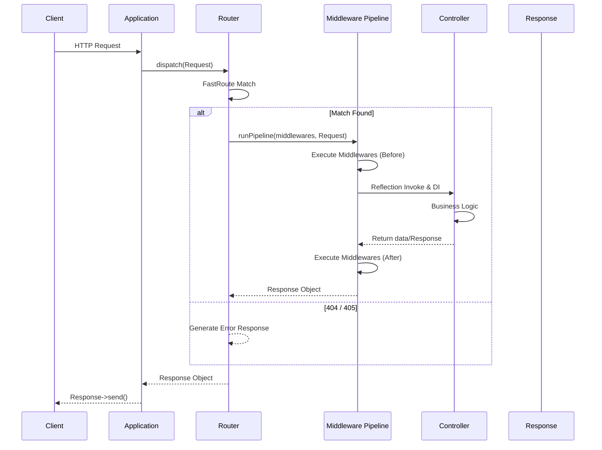
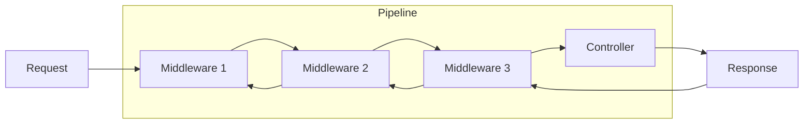
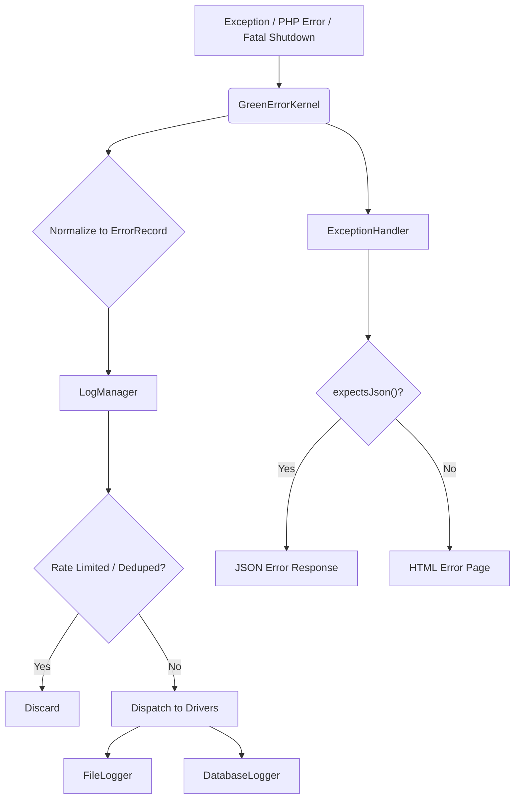
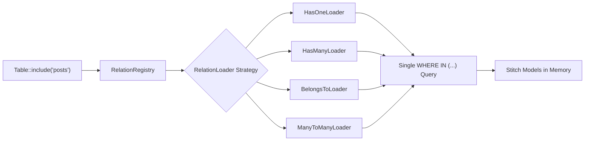

# Green Framework — Internal Core Architecture

> This document provides a deep, technical dive into the internal architecture of the Green Framework.  
> It is intended for core contributors, advanced developers, and anyone seeking to understand how the framework works under the hood.

---

## Table of Contents

1. [Why Green Exists](#1-why-green-exists)
2. [Bootstrap Process](#2-bootstrap-process)
3. [Application Lifecycle](#3-application-lifecycle)
4. [Request Lifecycle Diagram](#4-request-lifecycle-diagram)
5. [Service Container Internals](#5-service-container-internals)
6. [Router Internals](#6-router-internals)
7. [Middleware Pipeline Internals](#7-middleware-pipeline-internals)
8. [Validation Engine Internals](#8-validation-engine-internals)
9. [Error & Exception Handling](#9-error--exception-handling)
10. [Localization Engine](#10-localization-engine)
11. [Storage System Architecture (Drive)](#11-storage-system-architecture-drive)
12. [Connect Architecture (External HTTP APIs)](#12-connect-architecture-external-http-apis)
13. [ORM Architecture (Table Gateway & Data Mapper)](#13-orm-architecture-table-gateway--data-mapper)
14. [Session Management](#14-session-management)
15. [Extensibility & Service Providers](#15-extensibility--service-providers)
16. [Performance Optimizations](#16-performance-optimizations)
17. [View System (Twig Integration)](#17-view-system-twig-integration)
18. [Security Internals (CSRF)](#18-security-internals-csrf)

---

## 1. Why Green Exists

Green was built with a distinct identity and philosophy, reacting against the trend of overly complex, "magical" frameworks. It is designed to be **framework as infrastructure, not an ecosystem prison**.

| Principle | What it means in practice |
|---|---|
| **Explicit over Magic** | Code does what it says. No hidden abstractions, no implicit behaviors, no surprise auto-resolution. |
| **Minimal Core** | Ship essential features without bloat. Don't try to solve every conceivable problem out of the box. |
| **Predictable Runtime Behavior** | Without a massive DI container resolving hundreds of dependencies behind the scenes, the runtime path of any request is linear and easy to trace. |
| **Extensibility without Massive Abstraction** | Extend the framework by passing instances to clear, domain-specific Managers — no complex Service Providers or compiler passes. |
| **Low Memory Overhead** | Separate DTOs (`Model`) from persistence logic (`Table Gateway`). Avoid container bootstrapping on every request. |
| **Framework as Infrastructure** | Green gives you tools. It does not lock you into an opinionated ecosystem you can never leave. |

### Architectural Approach

The framework employs a minimalist, explicit architecture. Unlike heavy frameworks that rely on complex DI containers and pervasive Service Locators, Green opts for:

- **Direct instantiation** and explicit dependencies
- **Focused singletons** exposed via helper functions
- **Domain-specific managers** (`LogManager`, `DriveManager`, `ConnectManager`, `TranslatorManager`) instead of a monolithic container

**Key Architectural Principles:**

- **Decentralized Service Management** — No monolithic DI container. Each subsystem manages its own drivers and instances.
- **Data Mapper & Table Gateway ORM** — Strict separation between data container (`Model`) and database operations (`Table`).
- **Onion Middleware Pipeline** — HTTP requests flow through a functional pipeline of closures.
- **Reflection-Based Dispatch** — PHP's Reflection API injects dependencies and route parameters into controller methods.

---

## 2. Bootstrap Process

The framework bootstrapping is initiated in the [`Application`](../src/Application.php) class constructor.

```text
new Application()
  ├── loadConfiguration()      → Loads all PHP files from `config/` via ConfigRepository
  ├── registerCoreProviders()  → Registers Service Providers (Log, Error, Drive, Connect, Routing, Validation, View)
  └── bootProviders()          → Calls boot() on all registered providers
```

1. **`loadConfiguration()`** — Initializes the [`ConfigRepository`](../src/Config/Repository.php) and loads all `.php` files from the `config/` directory. The config is bound to the container and accessible via the `config()` helper.
2. **`registerCoreProviders()`** — Binds fundamental framework services into the Container via Service Providers.
3. **`bootProviders()`** — Executes the `boot` lifecycle method on all registered providers, initializing global helpers like `drive()`, `connect()`, and configuring the Twig view engine.

---

## 3. Application Lifecycle

1. **Capture** — The HTTP request is captured from PHP globals via [`Request::capture()`](../src/Http/Request.php).
2. **Handle** — The application entry point calls `Application::handle(Request)`.
3. **Dispatch** — The [`Router`](../src/Routing/Router.php) matches the HTTP method and URI against its compiled FastRoute dispatcher.
4. **Pipeline** — If matched, the Router merges global middlewares with route-specific middlewares and constructs a closure-based pipeline.
5. **Execution** — The request travels inward through the middlewares. At the core of the pipeline, the dispatcher uses Reflection to invoke the target controller method, automatically instantiating and injecting [`Payload`](../src/Http/Payload.php) classes (triggering validation) and the `Request` object.
6. **Response** — The controller returns data (array, string, or `Response` object). The pipeline normalizes this into a concrete [`Response`](../src/Http/Response.php) (e.g., [`JsonResponse`](../src/Http/JsonResponse.php)).
7. **Output** — `Response::send()` emits HTTP headers and content back to the client.

---

## 4. Request Lifecycle Diagram



---

## 5. Service Container Internals

Green utilizes a lightweight, native Service Container to manage dependencies and perform auto-wiring. 
The [`Application`](../src/Application.php) itself extends the [`Container`](../src/Container/Container.php).

### Container Features

- **Bindings & Singletons**: Use `bind()`, `singleton()`, and `instance()` for explicitly defining how dependencies are resolved.
- **Auto-Wiring**: Uses PHP's `ReflectionClass` to automatically inject dependencies into class constructors.
- **Circular Dependency Detection**: Prevents infinite loops when resolving nested dependencies.

### Resolving Dependencies

Dependencies can be resolved explicitly via `$app->make(ClassName::class)` or the global `app(ClassName::class)` helper. Most commonly, dependencies are automatically injected into Controllers and Middlewares by the Router's pipeline using the Container's auto-wiring capabilities.

---

## 6. Router Internals

The router is a lightweight, attribute-driven wrapper around [`nikic/fast-route`](https://github.com/nikic/FastRoute).

### Route Registration

Routes are declared directly on controller methods using PHP 8 Attributes:

```php
#[Route('GET', '/users/{id}', [AuthMiddleware::class])]
public function show(Request $request, int $id): array
```

[`Router::registerRoutesFromController()`](../src/Routing/Router.php) uses `ReflectionClass` to scan controllers for `#[Route]` attributes and registers them with FastRoute.

### Dispatch Flow

1. FastRoute compiles routes into an optimized regex tree via `FastRoute\simpleDispatcher`.
2. On dispatch, the matched handler + URI parameters are extracted.
3. The Router normalizes return types — if a controller returns an `array`, it's automatically wrapped in a [`JsonResponse`](../src/Http/JsonResponse.php).

---

## 7. Middleware Pipeline Internals

The middleware pipeline implements the classic **Onion Architecture** using nested closures.



Inside [`Router::runPipeline()`](../src/Routing/Router.php):

1. A **base closure** (the "core" of the onion) is created — responsible for reflecting the controller, injecting arguments, and invoking the method.
2. The middleware array is iterated in **reverse order** (`array_reverse`).
3. For each middleware, a new closure wraps the *previous* closure.
4. When the final pipeline executes, the request passes through each middleware's `handle($request, $next)` method, drilling down to the controller, then bubbling back up as a `Response`.

All middlewares implement [`MiddlewareInterface`](../src/Middleware/MiddlewareInterface.php):

```php
public function handle(Request $request, callable $next): Response;
```

---

## 8. Validation Engine Internals

Validation is encapsulated within the [`Http\Payload`](../src/Http/Payload.php) abstract class — serving as both a Form Request and a validated DTO.

### Lifecycle

```
Controller type-hints Payload subclass
  └── Router instantiates it with Request
        ├── prepareForValidation()   → Data sanitization hook
        ├── authorize()              → Authorization check (throws 403)
        └── validate()               → Respect\Validation rules
              └── On failure → throws ValidationException (422)
```

1. **Instantiation** — When `Router` detects a `Payload` type hint in a controller signature, it instantiates it, passing the current `Request`.
2. **`prepareForValidation()`** — Hook for pre-processing (e.g., trimming, normalizing file uploads).
3. **`authorize()`** — Returns `bool`. If `false`, throws a `403 Forbidden`.
4. **`validate()`** — Executes `Respect\Validation` rules defined in the `rules()` method.
5. **Exception** — On failure, throws [`ValidationException`](../src/Exceptions/ValidationException.php) with structured errors. The global [`ExceptionHandler`](../src/Exceptions/ExceptionHandler.php) renders a `422 Unprocessable Entity` response (JSON or HTML).

---

## 9. Error & Exception Handling

The error system is designed to **never break application execution**, using a custom kernel and normalization layer.

### Architecture



### Components

| Component | Role |
|---|---|
| [`GreenErrorKernel`](../src/ErrorHandling/GreenErrorKernel.php) | Central orchestrator. Registers `set_exception_handler`, `set_error_handler`, `register_shutdown_function`. Includes `isHandling` flag for loop prevention. |
| [`ErrorRecord`](../src/ErrorHandling/ErrorRecord.php) | Immutable value object. Every error (exception, PHP warning, fatal) is normalized into a standardized shape: ID, message, trace, request context, fingerprint. |
| [`LogManager`](../src/Logging/LogManager.php) | Dispatches `ErrorRecord` to all eligible drivers. Features per-request **deduplication** (max N logs per fingerprint) and file-based **rate limiting** (max N per time window). |
| [`ExceptionHandler`](../src/Exceptions/ExceptionHandler.php) | Presentation layer. Renders JSON or HTML error responses. Stack traces are only exposed when `APP_DEBUG=true`. |

### Logging Drivers

| Driver | Default Min Level | Output |
|---|---|---|
| [`FileLogger`](../src/Logging/Drivers/FileLogger.php) | `DEBUG` | Date-partitioned files: `green-YYYY-MM-DD.log` |
| [`DatabaseLogger`](../src/Logging/Drivers/DatabaseLogger.php) | `WARNING` | `error_logs` table via Doctrine DBAL |

---

## 10. Localization Engine

The translation engine is a multi-layered system designed for performance and complex pluralization — with first-class Arabic language support.

### Resolution Flow

```
Translator::get('messages.welcome', locale: 'ar_EG')
  └── FallbackChain::resolve()
        ├── Try 'ar_EG' across all providers
        ├── Try 'ar' across all providers
        ├── Try fallback_locale across all providers
        ├── Try default_locale across all providers
        └── Return raw key as last resort
```

### Components

| Component | Role |
|---|---|
| [`Translator`](../src/Translation/Translator.php) | Single entry point. Combines locale resolution, fallback, caching, interpolation, and pluralization. |
| [`FallbackChain`](../src/Translation/FallbackChain.php) | Chain of Responsibility. Builds a de-duplicated locale chain and queries providers in priority order. |
| [`Interpolator`](../src/Translation/Interpolator.php) | Variable substitution engine. Supports `:placeholder` and `{placeholder}` syntax in a single pass (no double-substitution). |
| [`PluralRuleFactory`](../src/Translation/Plural/PluralRuleFactory.php) | Returns language-specific plural rules. Ships with `EnglishPluralRule` and `ArabicPluralRule` (6 CLDR categories). |
| [`TranslatorManager`](../src/Translation/TranslatorManager.php) | Factory + fluent builder. Wires up providers, resolvers, cache, and plural rules. Also manages the global singleton for `t()` helper. |

### Providers

- [`JsonFileProvider`](../src/Translation/Provider/JsonFileProvider.php) — Reads from `lang/{locale}/` JSON files.
- [`DatabaseProvider`](../src/Translation/Provider/DatabaseProvider.php) — Reads from a `translations` database table.

### Locale Resolvers

Resolved via [`ChainLocaleResolver`](../src/Translation/Resolver/ChainLocaleResolver.php) (first non-null wins):
1. Custom resolvers → 2. [`RequestLocaleResolver`](../src/Translation/Resolver/RequestLocaleResolver.php) (header/query/cookie) → 3. [`SystemLocaleResolver`](../src/Translation/Resolver/SystemLocaleResolver.php) (default locale)

---

## 11. Storage System Architecture (Drive)

The `Drive` subsystem provides filesystem abstraction using the **Strategy pattern**.

### Architecture

```
Drive (injectable facade)
  └── DriveManager (registry + lazy resolver)
        ├── disk('local')  → LocalDriver
        ├── disk('public') → LocalDriver (different root)
        └── disk('s3')     → CustomDriver (via extend())
```

| Component | Role |
|---|---|
| [`Drive`](../src/Drive/Drive.php) | Primary injectable service. Delegates all operations to the configured default disk via `DriveManager`. |
| [`DriveManager`](../src/Drive/DriveManager.php) | Central disk resolver. Reads config, lazy-instantiates drivers, caches resolved instances, supports `extend()` for custom drivers and `fake()` for testing. |
| [`DriveDriverInterface`](../src/Drive/Contracts/DriveDriverInterface.php) | Contract for all storage drivers: `put`, `get`, `delete`, `exists`, `copy`, `move`, `files`, `readStream`, `writeStream`, etc. |
| [`PathValidator`](../src/Drive/PathValidator.php) | **Security-critical.** Normalizes paths and guards against directory traversal (`..`), null-byte injection (`\0`), control characters, and root escape via symlinks. Every driver MUST pass paths through `resolve()` before filesystem I/O. |
| [`FakeDriver`](../src/Drive/Drivers/FakeDriver.php) | In-memory driver for testing. Supports assertions like `assertExists()`. |

---

## 12. ORM Architecture (Table Gateway & Data Mapper)

Green implements a database layer that rejects the Active Record pattern in favor of strict separation of concerns.

### Core Separation

| Layer | Class | Responsibility |
|---|---|---|
| **Data Container** | [`Model`](../src/Database/Model.php) | Pure DTO. Holds state, implements `JsonSerializable`. Contains **zero** database logic. |
| **Persistence** | [`Table`](../src/Database/Table.php) | Table Gateway. Handles all CRUD: `insert`, `update`, `delete`, `fetchById`, `fetchAll`, `paginate`, `include`. |
| **Query Building** | Doctrine DBAL | `QueryBuilder` for composing SQL. |

### Relation Engine & Eager Loading

The ORM solves the N+1 query problem through a **Strategy-based** relation engine.



- [`RelationRegistry`](../src/Database/Relations/RelationRegistry.php) — Maps relation types (`hasOne`, `hasMany`, `belongsTo`, `manyToMany`) to concrete `RelationLoader` implementations.
- **Single Query Eager Loading** — When `->include('posts.comments')` is called, the `Table` gathers all foreign keys and delegates to the appropriate `RelationLoader`. The loader executes exactly **one** `WHERE IN (...)` query and stitches the results back in memory.

### Include Query Language (IQL)

The framework features a custom parser ([`IncludeQueryEngine`](../src/Database/IncludeQuery/IncludeQueryEngine.php)) for advanced API-driven eager loading:

```
->include('comments(limit:5,order:desc).author(select:id|name)')
```

Pipeline: **Raw String → Parse (AST) → Validate → Resolve (Closure constraints)**

The resolved closures modify the underlying `QueryBuilder` before the relation is fetched.

---

## 13. Session Management

The session layer is a thin, ergonomic wrapper around Symfony's `HttpFoundation\Session`.

| Component | Role |
|---|---|
| [`SessionManager`](../src/Session/SessionManager.php) | Wraps `Symfony\Component\HttpFoundation\Session\Session`. Auto-starts the session on construction. |

**Key operations:** `get()`, `put()`, `has()`, `forget()`, `flush()`, `flash()`, `getFlash()`, `regenerateId()`.

Flash data uses Symfony's `FlashBag` — values are automatically removed after being read once.

---

## 14. Extensibility & Service Providers

Extensibility in Green is managed primarily through **Service Providers**.

### Service Providers

Providers extend the abstract [`ServiceProvider`](../src/Support/ServiceProvider.php) class and contain two lifecycle methods:

- `register()`: Bind things into the container. Do not execute any logic or resolve other services here.
- `boot()`: Execute bootstrap logic after all other providers have been registered.

```php
class CustomServiceProvider extends ServiceProvider
{
    public function register(): void
    {
        $this->app->singleton(MyService::class, fn($app) => new MyService($app->make('config')));
    }

    public function boot(): void
    {
        // Application setup logic
    }
}
```

This architecture ensures a clean, predictable bootstrapping phase. Domain managers (like `DriveManager` and `TranslatorManager`) can also be extended directly within the `boot()` method of a provider.

---

## 15. Performance Optimizations

| Optimization | How |
|---|---|
| **Lazy Initialization** | Subsystems (DB connection, specific Drive disks, Session) are only instantiated on first use. |
| **No Reflection on Boot** | Unlike DI containers that scan the codebase at startup, Reflection is only used dynamically on the specific controller method being dispatched. |
| **ORM Memory Efficiency** | Separating `Model` (lightweight DTO) from `Table` (stateless gateway) keeps the per-object memory footprint minimal. |
| **O(1) Pluralization** | CLDR plural rules are pure mathematical functions (e.g., `ArabicPluralRule`), not lookup tables. |
| **Single-Query Eager Loading** | Relations are loaded with `WHERE IN (...)` — one query per relation level, not one per parent row. |

---

## 16. View System (Twig Integration)

The framework wraps [`twig/twig`](https://twig.symfony.com/) as its primary templating engine.

| Feature | Implementation |
|---|---|
| **Initialization** | [`View::init()`](../src/View/View.php) boots Twig and injects global helpers: `session()`, `t()`, `trans_choice()`, `csrf_token()`, `csrf_field()`. |
| **CSRF Enforcement** | `View::render()` post-processes rendered HTML. It scans for `<form>` tags with `method="POST/PUT/DELETE"` and throws a hard `RuntimeException` if `{{ csrf_field() }}` is missing — preventing insecure forms from ever shipping. |

---

## 17. Security Internals (CSRF)

### Token Lifecycle

```
Form Render                          Form Submit
    │                                     │
    ▼                                     ▼
csrf_field() → CsrfTokenManager     CsrfMiddleware
    │              │                      │
    │         generate()              validate(id, token)
    │              │                      │
    │         Store in Session        hash_equals() check
    │         (with TTL + max cap)        │
    │              │                  Consume token (single-use)
    ▼              ▼                      │
  Hidden        Session                   ▼
  Inputs        Storage              Pass or throw
                                     TokenMismatchException
```

| Component | Role |
|---|---|
| [`CsrfMiddleware`](../src/Http/Middleware/CsrfMiddleware.php) | Intercepts all non-safe HTTP methods (POST, PUT, DELETE, PATCH). Skips configurable exception paths. |
| [`CsrfTokenManager`](../src/Security/Csrf/CsrfTokenManager.php) | Generates cryptographic token pairs (`random_bytes`). Validates with timing-safe `hash_equals()`. Tokens are single-use (consumed on validation). |
| [`CsrfConfig`](../src/Security/Csrf/CsrfConfig.php) | Configurable TTL (default: 30min), max active tokens (default: 50), session key, input/header names, and exception paths. |
